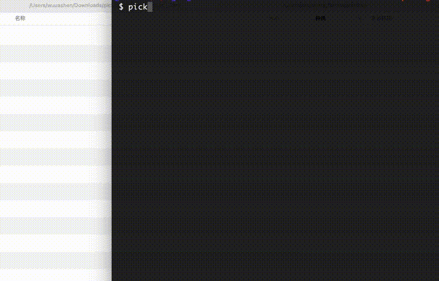

<p style="text-align: left">
  
</p>

>抓取社交网站用户的媒体文件的CLI爬虫工具

<br>

<!-- <video autoplay>
  <source src="docs/kap.mp4" type="video/mp4">
</video> -->



<br>

## 特性
- 批量下载，一次性下载指定用户的所有媒体文件
- 记录错误日志，并且可再次下载曾经下载失败的文件
- 文件排重，如果之前已经下载过该文件，重复下载时会排除掉，避免下载重复的文件
- 自动重试，当网络不稳定时，会自动重试下载
- 可限制文件下载并发数
- 支持代理请求及cookie请求

## 支持列表
- instagram
- weibo

<br>

## 安装

需要先安装 Nodejs 环境 >= v16.14.0

https://nodejs.org/en/

然后安装脚本：

```bash
$ npm install pick-get -g
```
<br>

## 使用
```bash
Usage: pick-get <command> [options] <user-id>

批量抓取社交网站用户的媒体文件的CLI爬虫工具, 目前支持weibo和instagram

Options:
  -p, --path [char]          文件下载目录 (default: "当前命令行目录")
  -c, --cookie [char]        使用cookie文件请求数据，只支持 Netscape格式 https://curl.se/rfc/cookie_spec.html
  -x, --proxy [url]          使用代理服务器，格式：${protocol}${hostname}${port}
  -t, --tryerr               下载日志中记录的下载失败的文件
  --timeout [number]         设置下载文件超时时间，如果经常提示超时可以设置大一些 (default: 30000)
  --count [number]           限制文件下载数量，否则将所有文件下载完成
  --limit [number]           限制文件下载并发数 (default: 3)
  -V, --version              output the version number
  -h, --help                 display help for command

Commands:
  weibo [options] <user-id>  抓取微博用户媒体文件
  instagram <user-id>        抓取instagram用户媒体文件
  help [command]             display help for command


```

<br>

```bash
Usage: pick-get weibo [options] <user-id>

抓取微博用户媒体文件

Options:
  -v, --video  只下载视频文件
  -h, --help   display help for command

Example: 
  pick-get weibo 5769900702

```

<br>

```bash
Usage: pick-get instagram [options] <user-id>

抓取instagram用户媒体文件

Options:
  -h, --help  display help for command

Example: 
  pick-get instagram lets_kate__

```

<br>

## FAQ
Q: 我应该从那里获取Netscape格式的cookie文件？

A: 最简单的方法下载这个chrome扩展：https://chrome.google.com/webstore/detail/get-cookiestxt/bgaddhkoddajcdgocldbbfleckgcbcid

Q: 为什么经常提示超时或网络异常？

A: 受网络环境和网站防爬，批量下载不可能非常稳定的，且用且珍惜

Q: 如果下载失败的数量过多怎么办？

A: 稍后使用--tryerr参数重试

<br>


